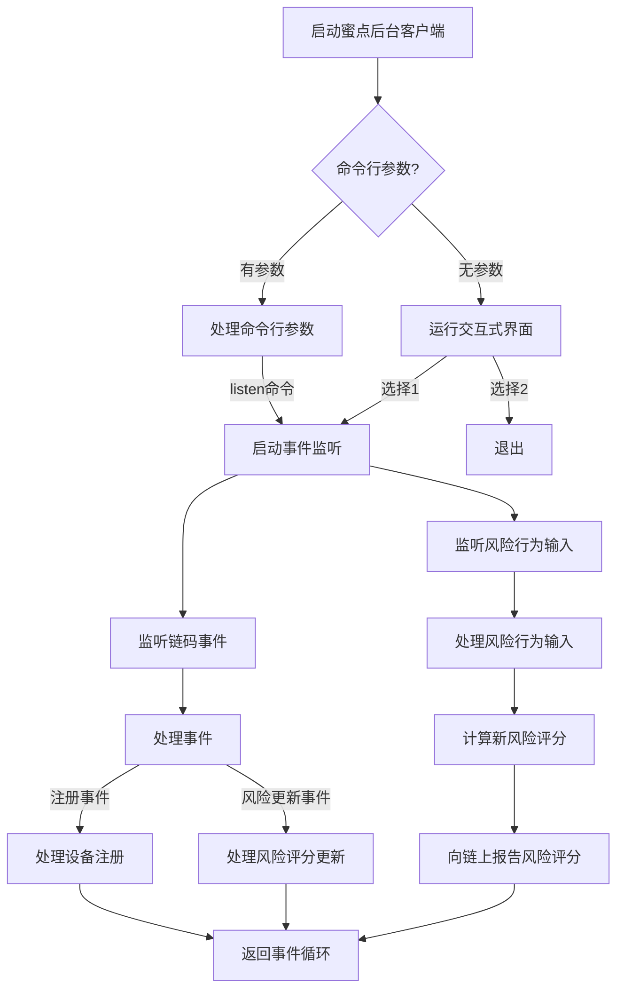
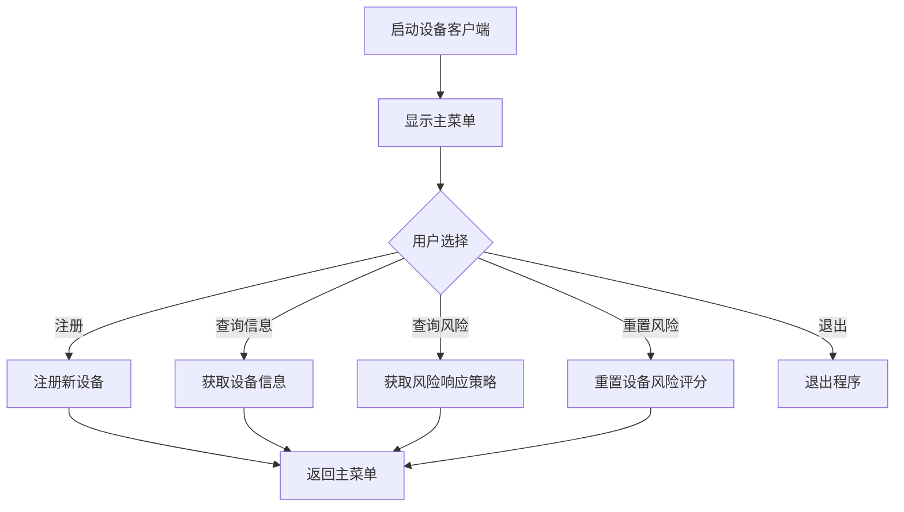
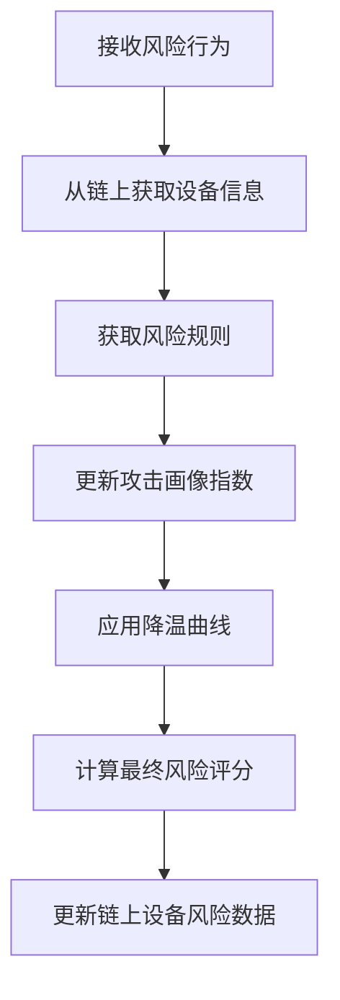

# IEEE蜜点系统

本项目是基于Hyperledger Fabric区块链的蜜点系统，用于配电网安全防护。系统通过区块链技术构建分布式信任基础设施，实现设备身份和操作权限的去中心化管理，并基于DAG蜜点架构实现对攻击行为的诱捕、识别和快速响应。

## 项目结构

```
hyperledger-fabric/chaincode/IEEE/
├── chain/                      # 区块链智能合约
│   ├── contracts/              # 合约实现
│   │   ├── identity_contract.go # 身份认证合约
│   │   └── risk_contract.go    # 风险评估合约
│   ├── models/                 # 数据模型
│   │   └── device.go           # 设备模型
│   └── utils/                  # 工具函数
├── chain_docker/               # Docker配置
│   └── docker-compose.yaml     # Docker Compose配置文件
├── config.json                 # 配置文件
├── honeypoint_client/          # 蜜点后台客户端
│   ├── client/                 # 客户端核心模块
│   │   ├── config.go           # 配置加载模块
│   │   ├── chain_client.go     # 区块链客户端
│   │   └── honeypoint_client.go # 后台客户端核心
│   ├── db/                     # 数据库模块
│   │   └── database.go         # 数据库管理
│   ├── risk/                   # 风险评估模块
│   │   └── assessment.go       # 风险评估算法
│   └── main.go                 # 主程序入口
├── device_client/              # 设备客户端
│   ├── client/                 # 客户端核心模块
│   │   ├── config.go           # 配置模块
│   │   └── device_client.go    # 设备客户端核心
│   └── main.go                 # 主程序入口
└── go.mod                      # Go模块定义
```

## 系统架构

系统由以下几个主要组件构成：

1. **区块链智能合约**：实现设备身份管理、风险评分更新等核心功能
2. **蜜点后台客户端**：监听区块链事件，处理风险行为，计算风险评分
3. **设备客户端**：提供设备注册等功能
4. **MySQL数据库**：存储风险规则

## 数据库设计

系统使用MySQL数据库存储以下信息：

1. **risk_rules表**：存储风险评分规则
   - id：规则ID
   - behavior_type：行为类型
   - category：行为类别
   - score：行为得分（小数点后两位）
   - weight：行为权重
   - description：规则描述

## 区块链存储设计

系统在区块链上存储以下信息：

1. **设备信息**：
   - did：设备分布式标识符
   - name：设备名称
   - model：设备型号
   - vendor：设备供应商
   - riskScore：历史风险分数
   - attackIndexI：攻击画像指数
   - attackProfile：攻击画像（行为类别集合）
   - lastEventTime：上次事件时间
   - status：设备状态
   - createdAt：创建时间
   - lastUpdatedAt：最后更新时间

## 风险评分算法

系统实现了基于历史行为和时间衰减的风险评分算法：

1. **更新攻击画像指数 (I)**：
   - 如果当前行为类别不在设备的攻击画像集合中（意图升级）：
     ```
     ΔI = W
     ```
   - 如果已存在（持续试探）：
     ```
     ΔI = 0
     ```
   - 完成I的累加：
     ```
     I_new = I_old + ΔI
     ```

2. **计算实时风险分 (S_t)**：
   - 对历史分数进行降温：
     ```
     S'_{t-1} = max(0, S_{t-1} - (δ * Δt) / (1 + α * S_{t-1}))
     ```
   - 计算最终得分：
     ```
     S_t = min(S_max, S_base * (1+I) + S'_{t-1})
     ```
   
3. **后台状态维护**：
   - I慢速衰减：
     ```
     I_new = I_old * e^(-λ*Δt)
     ```

其中：
- S_t：本次计算分数
- S_max：最高得分（1000分）
- S_base：当前行为基础得分
- I：攻击画像指数
- δ：影响低分时降温速度参数（0.05）
- Δt：上次风险行为和本次风险行为的时间间隔
- α：影响高分时降温速度参数（0.02）
- λ：攻击画像指数衰减系数（0.01）
- W：行为权重

## 代码执行流程

### 蜜点后台客户端流程



### 设备客户端流程



### 风险评分计算流程



## 系统功能

### 蜜点后台客户端功能

1. **事件监听**：监听区块链上的设备注册和风险评分更新事件
2. **风险行为处理**：接收风险行为输入，计算设备风险评分
3. **数据库管理**：管理风险规则

### 设备客户端功能

1. **设备注册**：注册新设备到区块链
2. **设备信息查询**：查询设备信息
3. **风险响应策略查询**：查询设备的风险响应策略
4. **风险评分重置**：重置设备风险评分

## 风险响应策略

系统根据设备风险评分实施不同的响应策略：

1. **常规（0分）**：标准化信任与监控
   - 维持默认的日志记录
   - 仅在会话建立或关键操作时通过智能合约验证其DID身份的有效性

2. **关注（1-199分）**：增强监控，主动引诱
   - 针对该设备的源IP，自动启用全数据包捕获
   - 详细记录其在蜜点中的所有操作行为
   - 实施轻微的服务质量策略，对其扫描或连接行为进行速率限制
   - 在其当前互动的蜜点环境中，主动暴露更具吸引力的诱饵

3. **警戒（200-699分）**：主动欺骗与隔离引导
   - 将该设备的所有内部域名解析请求指向对应的伪造服务
   - 在网络层将其流量重定向至一个隔离的蜜网环境中
   - 在其所处的蜜网环境中，动态植入伪造的凭证文件、数据库连接字符串、API密钥等蜜点

4. **高危（700-1000分）**：硬性阻断
   - 立即强制中断该设备所有已建立的网络连接
   - 临时锁定设备账户
   - 对其交互过的蜜点进行快照存证
   - 进入人工介入和深度溯源

## 运行说明

### 环境要求

- Go 1.18+
- Hyperledger Fabric 2.2+
- MySQL 8.0+

### 配置文件

在`config.json`中配置区块链连接信息和MySQL数据库连接信息：

```json
{
  "CertPath": "../../organizations/peerOrganizations/org1.chain.com/users/User1@org1.chain.com/tls/client.crt",
  "KeyPath": "../../organizations/peerOrganizations/org1.chain.com/users/User1@org1.chain.com/msp/keystore/",
  "TLSCertPath": "../../organizations/peerOrganizations/org1.chain.com/peers/peer0.org1.chain.com/tls/ca.crt",
  "MSPID": "Org1MSP",
  "ChannelName": "mychannel",
  "ChaincodeName": "chaincc",
  "PeerEndpoint": "localhost:8051",
  "GatewayPeer": "peer0.org1.chain.com",
  "DBHost": "127.0.0.1",
  "DBPort": 3306,
  "DBUser": "root",
  "DBPassword": "1",
  "DBName": "ieee_honeypoint"
}
```

### 数据库初始化

创建MySQL数据库和表：

```sql
CREATE DATABASE ieee_honeypoint;
USE ieee_honeypoint;

CREATE TABLE risk_rules (
  id INT AUTO_INCREMENT PRIMARY KEY,
  behavior_type VARCHAR(50) NOT NULL UNIQUE,
  category VARCHAR(50) NOT NULL,
  score DECIMAL(10,2) DEFAULT 0.00,
  weight DECIMAL(10,2) DEFAULT 0.00,
  description VARCHAR(255)
);

-- 插入风险规则
INSERT INTO risk_rules (behavior_type, category, score, weight, description) VALUES
('visit_trap_ip', 'Recon', 10.0, 0.2, '访问陷阱IP'),
('connect_bait_wifi', 'Recon', 15.0, 0.2, '连接诱饵WiFi'),
('port_scan_honeypot', 'Recon', 20.0, 0.2, '对蜜点进行端口扫描');
-- 更多规则...
```

### 运行蜜点后台客户端

```bash
cd honeypoint_client
go run main.go
```

### 运行设备客户端

```bash
cd device_client
go run main.go
```

## 风险行为输入格式

在蜜点后台客户端运行时，可以输入风险行为，格式为：`<设备DID> <行为类型>`

例如：
- `risk did:ieee:device:1234567890abcdef visit_trap_ip` - 设备访问陷阱IP
- `risk did:ieee:device:abcdef1234567890 port_scan_honeypot` - 设备对蜜点进行端口扫描

## 系统交互流程

1. 设备通过设备客户端注册到区块链
2. 蜜点后台客户端监听到注册事件，启动对该设备的风险监控
3. 蜜点后台客户端接收风险行为输入，计算设备风险评分
4. 蜜点后台客户端向区块链报告最新风险评分、攻击画像指数和攻击画像
5. 根据设备的风险评分，系统自动执行相应的风险响应策略