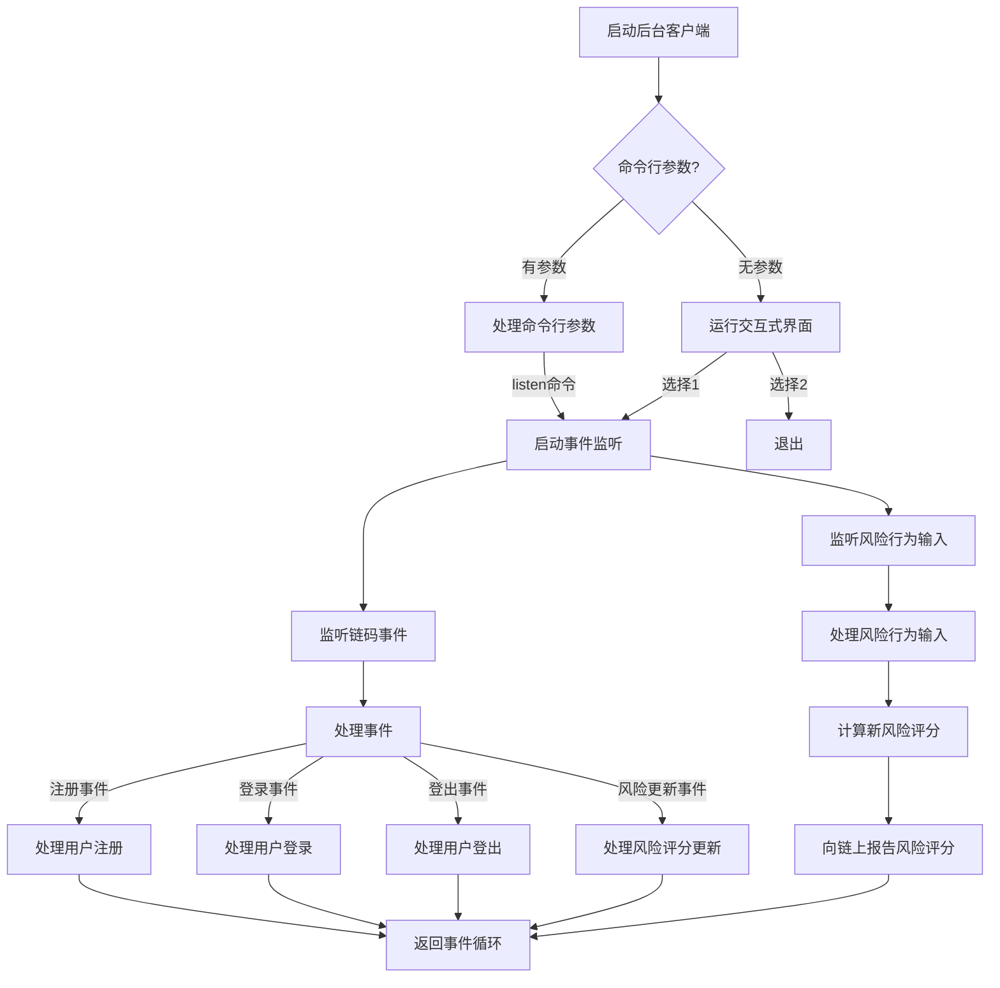
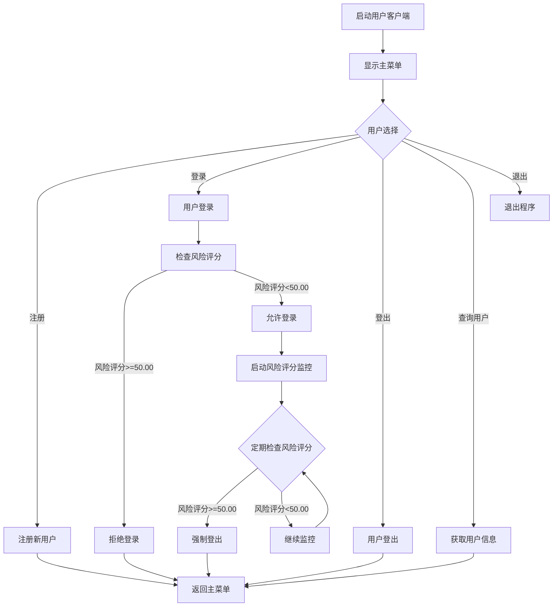
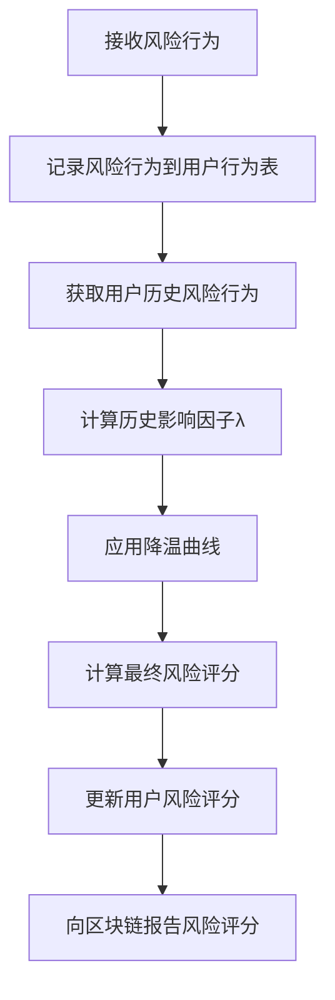

# IEEE蜜点系统

本项目是基于Hyperledger Fabric区块链的蜜点系统，用于配电网安全防护。系统通过区块链技术构建分布式信任基础设施，实现用户身份和操作权限的去中心化管理，并基于DAG蜜点架构实现对攻击行为的诱捕、识别和快速响应。

## 项目结构

```
hyperledger-fabric/chaincode/IEEE/
├── chain/                      # 区块链智能合约
│   ├── contracts/              # 合约实现
│   │   └── identity_contract.go # 身份认证合约
│   ├── models/                 # 数据模型
│   │   └── user.go             # 用户模型
│   └── utils/                  # 工具函数
├── chain_docker/               # Docker配置
│   └── docker-compose.yaml     # Docker Compose配置文件
├── config.json                 # 配置文件
├── honeypoint_client/          # 后台客户端
│   ├── client/                 # 客户端核心模块
│   │   ├── config.go           # 配置加载模块
│   │   ├── db_manager.go       # 数据库管理模块
│   │   ├── honeypoint_client.go # 后台客户端核心
│   │   ├── risk_input.go       # 风险行为输入模块
│   │   └── risk_manager.go     # 风险评分管理模块
│   └── main.go                 # 主程序入口
├── user_client/                # 用户客户端
│   ├── client/                 # 客户端核心模块
│   │   └── user_client.go      # 用户客户端核心
│   └── main.go                 # 主程序入口
└── go.mod                      # Go模块定义
```

## 系统架构

系统由以下几个主要组件构成：

1. **区块链智能合约**：实现用户身份管理、风险评分更新等核心功能
2. **后台客户端**：监听区块链事件，处理风险行为，计算风险评分
3. **用户客户端**：提供用户注册、登录、登出等功能
4. **MySQL数据库**：存储用户信息、风险行为记录和风险规则

## 数据库设计

系统使用MySQL数据库存储以下信息：

1. **users表**：存储用户基本信息和当前风险评分
   - id：用户ID
   - did：用户分布式标识符
   - name：用户名称
   - current_score：当前风险评分（小数点后两位）
   - last_update：最后更新时间
   - created_at：创建时间

2. **用户行为表（动态创建）**：为每个用户创建单独的行为表，表名格式为`user_behaviors_{did}`
   - id：记录ID
   - behavior_type：行为类型
   - score：行为得分（小数点后两位）
   - timestamp：行为时间

3. **risk_rules表**：存储风险评分规则
   - id：规则ID
   - behavior_type：行为类型
   - score：行为得分（小数点后两位）
   - description：规则描述

## 风险评分算法

系统实现了基于历史行为和时间衰减的风险评分算法：

1. **分数更新**：
   ```
   St = min(Smax, (Score + St-1') * λ)
   ```
   其中：
   - St为本次计算分数
   - Smax为最高得分
   - Score为当前行为得分
   - St-1'为经过降温曲线处理的上次分数

2. **历史风险行为影响因子**：
   ```
   λ = 1 + (∑e^(-β(t-tj)) * Sp,j) / T
   ```
   其中：
   - N：用户历史风险行为记录总数
   - T：风险分数归一化基数
   - β：衰减速率系数
   - Sp,j：第j次风险行为的分数
   - tj：第j次风险行为发生时间

3. **降温曲线**：随着时间推移，风险评分会逐渐降低
   ```
   St-1' = max(0, St-1 - (δ * Δt) / (1 + α * St-1))
   ```
   其中：
   - St-1：上次计算得分
   - δ：影响低分时降温速度参数
   - Δt：上次风险行为和本次风险行为的时间间隔
   - α：影响高分时降温速度参数

## 代码执行流程

### 后台客户端流程



### 用户客户端流程



### 风险评分计算流程



## 系统功能

### 后台客户端功能

1. **事件监听**：监听区块链上的用户注册、登录、登出和风险评分更新事件
2. **风险行为处理**：接收风险行为输入，计算用户风险评分
3. **数据库管理**：管理用户信息、风险行为记录和风险规则

### 用户客户端功能

1. **用户注册**：注册新用户到区块链
2. **用户登录**：用户登录，检查风险评分
3. **用户登出**：用户登出
4. **风险评分监控**：监控用户风险评分，当风险评分超过阈值时强制登出

## 运行说明

### 环境要求

- Go 1.16+
- Hyperledger Fabric 2.2+
- MySQL 8.0+

### 配置文件

在`config.json`中配置区块链连接信息和MySQL数据库连接信息：

```json
{
  "CertPath": "../../organizations/peerOrganizations/org1.chain.com/users/User1@org1.chain.com/tls/client.crt",
  "KeyPath": "../../organizations/peerOrganizations/org1.chain.com/users/User1@org1.chain.com/msp/keystore/",
  "TLSCertPath": "../../organizations/peerOrganizations/org1.chain.com/peers/peer0.org1.chain.com/tls/ca.crt",
  "MSPID": "Org1MSP",
  "ChannelName": "mychannel",
  "ChaincodeName": "chaincc",
  "PeerEndpoint": "localhost:8051",
  "GatewayPeer": "peer0.org1.chain.com",
  "DBHost": "127.0.0.1",
  "DBPort": 3306,
  "DBUser": "root",
  "DBPassword": "1",
  "DBName": "ieee_honeypoint"
}
```

### 数据库初始化

创建MySQL数据库和表：

```sql
CREATE DATABASE ieee_honeypoint;
USE ieee_honeypoint;

CREATE TABLE users (
  id INT AUTO_INCREMENT PRIMARY KEY,
  did VARCHAR(255) UNIQUE NOT NULL,
  name VARCHAR(255) NOT NULL,
  current_score DECIMAL(10,2) DEFAULT 0.00,
  last_update TIMESTAMP DEFAULT CURRENT_TIMESTAMP,
  created_at TIMESTAMP DEFAULT CURRENT_TIMESTAMP
);

CREATE TABLE risk_rules (
  id INT AUTO_INCREMENT PRIMARY KEY,
  behavior_type VARCHAR(50) UNIQUE NOT NULL,
  score DECIMAL(10,2) NOT NULL,
  description VARCHAR(255)
);

-- 插入风险规则
INSERT INTO risk_rules (behavior_type, score, description) VALUES
('edge_honeypot', 2.00, '访问非关键蜜点'),
('business_honeypot', 6.00, '访问业务处理类蜜点'),
('core_honeypot', 9.00, '访问模拟核心控制系统的蜜点');
-- 更多规则...
```

### 运行后台客户端

```bash
cd honeypoint_client
go run main.go
```

### 运行用户客户端

```bash
cd user_client
go run main.go
```

## 风险行为输入格式

在后台客户端运行时，可以输入风险行为，格式为：`DID:行为类型`

例如：
- `did:example:123:edge_honeypot` - 用户DID为did:example:123，行为类型为访问非关键蜜点
- `did:example:456:core_honeypot` - 用户DID为did:example:456，行为类型为访问核心蜜点

## 系统交互流程

1. 用户通过用户客户端注册账户
2. 后台客户端监听到注册事件，初始化用户风险评分为0.00
3. 用户通过用户客户端登录
4. 后台客户端监听到登录事件，为用户创建专属行为表并记录用户登录状态
5. 后台客户端接收风险行为输入，计算用户风险评分
6. 后台客户端向区块链报告最新风险评分
7. 用户客户端监控用户风险评分，当风险评分超过阈值(50.00)时强制登出
8. 用户通过用户客户端登出
9. 后台客户端监听到登出事件，记录用户登出状态